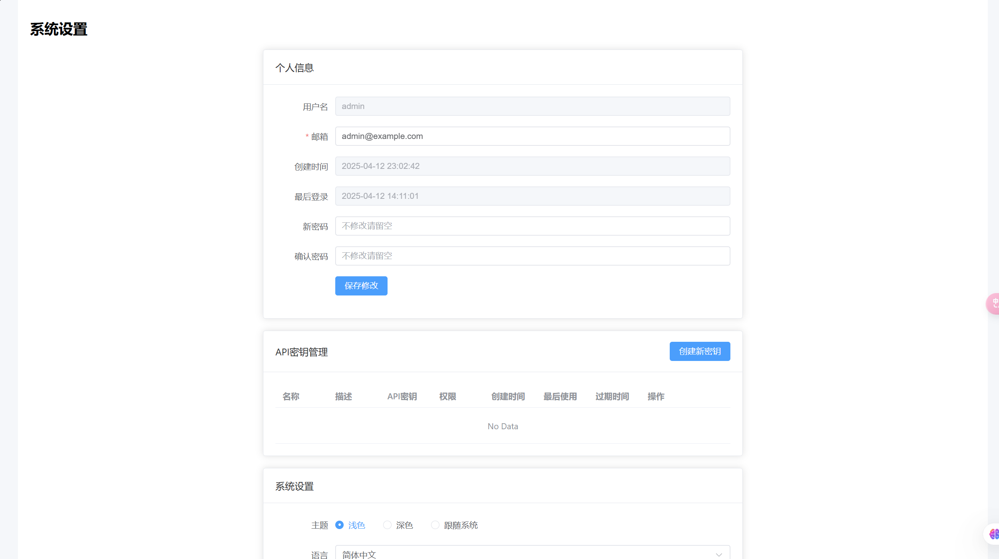

# argus
Argus is a malware analysis platform built with Vue 3 and Python

## 系统依赖
* strings相关
apt-get install binutils

* TLSH相关
apt-get install -y libssl-dev

* magic相关
apt-get install -y libmagic1 python3-magic

* ssdeep相关
apt-get install -y ssdeep

* exiftool相关
apt install libimage-exiftool-perl

* yara相关
apt-get install yara

## 页面简介
### 认证模块
登录页面


注册页面


### 首页
* 路径: /home
* 功能: 首页数据展示

**首页基本信息界面**


### 搜索
* 路径: /search
* 功能: 全局搜索功能

**搜索界面**


**搜索提示界面**


### 样本管理
* 路径: /samples
* 功能: 样本文件的上传、下载、查询详情等功能（样本详情的部分功能需要安装cape沙箱）

**样本列表界面**


**样本上传界面**


**样本详情界面**


**情报IOC界面**

目前均为模拟数据
TODO:


**行为分析界面**

目前均为模拟数据
TODO:

**多维分析界面**

多维分析部分主要集成了下面两部分（均需要Cape沙箱支持）
* Yara规则扫描内存dump

* Sigma规则


**引擎检测界面**

目前均为模拟数据

引擎检测部分只支持clamav，其他引擎均需要自己添加


### 分析任务

功能: 分析任务的创建、配置、结果查询等

### Yara规则 (yara.py)
路径: /yara
功能: Yara规则的创建、更新、查询等


### 任务管理 (tasks.py)
* 路径: /tasks
* 功能: 后台任务管理

### 用户管理 (users.py)
* 路径: /users
* 功能: 用户信息管理，提供以下信息的设置

**设置界面**

* 个人信息管理
* API密钥管理
* 系统主题管理

### 数据迁移 (migration.py)
路径: /migration

功能: 文件存储引擎可以选择对象存储引擎或者本地文件存储，本模块提供本地存储和对象存储互相迁移的功能

**样本迁移界面**


### Exif工具 (exiftool.py)
功能: 处理文件元数据

## 部署
### 1、单独部署后端
* 1、cd到后端目录
* 2、修改环境变量和config文件
    * argus-backend/.env
    * argus-backend/app/core/config.py
* 3、使用Dockerfile编译镜像
    ```docker
    docker build -t argus-latest .
    ```
    **Tips**: `argus-backend/Dockerfile`中配置了代理，你可以改为自己的代理，也可以注释掉
* 4、使用编译好的镜像启动一个容器
    ```bash
    docker run -itd -p 8000:8000 --name argus-container argus-latest
    ```
### 2、单独部署前端

### 3、demo环境（前端+后端+mongodb+minio）


## API说明
### 用户
#### 1、用户注册
```bash
curl -X POST "http://localhost:8000/api/v1/auth/register?username=testuser&email=test@example.com&password=Test123!@#&is_active=true&is_superuser=false"
```

#### 2、用户token获取（带验证码）

**Step1: 获取验证码**
```bash
curl -X GET "http://localhost:8000/api/v1/auth/captcha?client_id=test123" -o captcha.png
```

**Step1: 带验证码登录**


#### 3、用户token获取（不带验证码）
```bash
curl -X POST http://localhost:8000/api/v1/auth/token -H 'Content-Type: application/x-www-form-urlencoded' -d 'username=usernamexxxx&password=passwordxxxx'
```

### 样本
#### 文件上传

#### 文件下载

#### 文件删除

### 信息查询

## TODO
### 漏洞详情页
* 1、漏洞详情页面添加 [magika](https://github.com/google/magika) 工具
* 2、漏洞详情页面添加 [Die](https://github.com/horsicq/DIE-engine/releases) 工具
* 3、漏洞详情页面添加 [Trid]() 工具

### API管理


## PE节区信息
Windows 资源语言和子语言的官方定义可以在以下位置找到：
Windows SDK 头文件：
winnt.h 文件中包含了完整的语言和子语言定义
路径通常在：C:\Program Files (x86)\Windows Kits\10\Include\<version>\um\winnt.h
MSDN 文档：
语言标识符：https://learn.microsoft.com/en-us/windows/win32/intl/language-identifiers
子语言标识符：https://learn.microsoft.com/en-us/windows/win32/intl/sublanguage-identifiers
Windows API 参考：
LANGID 和 SUBLANGID 宏的定义
MAKELANGID 和 MAKESUBLANGID 宏的使用方法